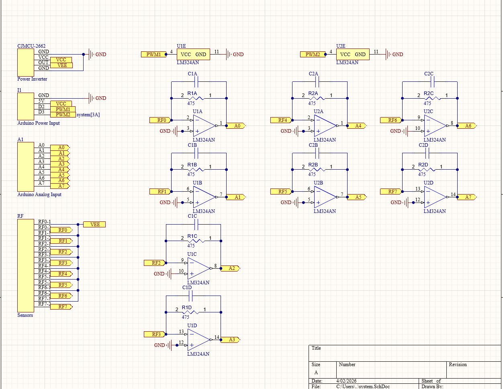
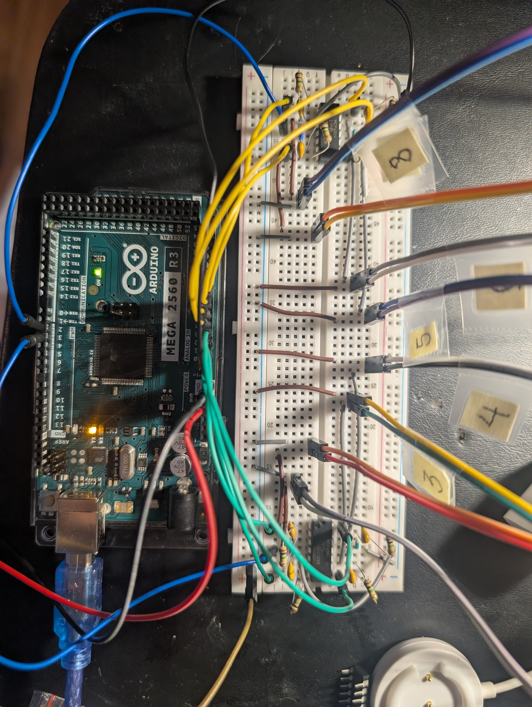
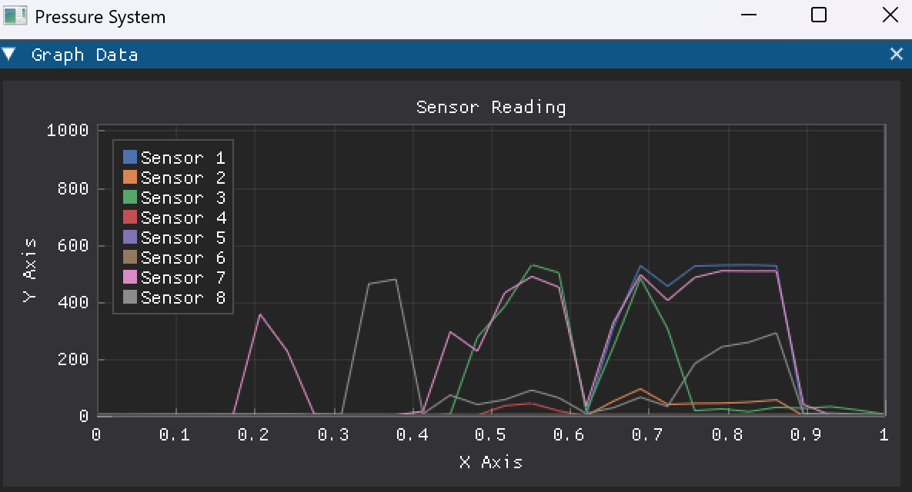

# Pressure System
A pressure system designed to aid in fitting prosthetics for patients with little or no feeling in their leg. 

## Hardware

The device is power by an Arduino Mega. This takes reading from the Flexi A301 sensors. There are eight sensors, each of which requires an op amp circuit to function. 

### Schematic

### Prototype

Below is the breadboard prototype. 

## Software

The code for the Arduino can be found in the `mc-src` folder. The communicates with a Python application. The computer application graphs the data in real time.

